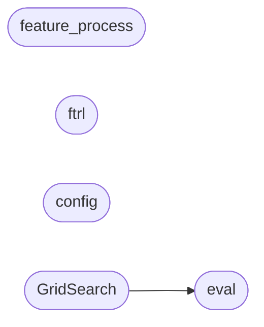

# Code Overview

[_Documentation generated by Documatic_](https://www.documatic.com)

<!---Documatic-section-Codebase Structure Python-start--->
## Codebase Structure Python

The codebase has a flat structure, with 6 code files.

<!---Documatic-block-system_architecture-start--->

<!---Documatic-block-system_architecture-end--->

# #
<!---Documatic-section-Codebase Structure Python-end--->

<!---Documatic-section-Important Functions-start--->
## Important Functions

<!---Documatic-block-important_funcs-start--->
<!---Documatic-block-most_used_funcs-start--->
### Most Utilised Functions

* [woe.eval.compute_ks](3-woe_eval.md#woe.eval.compute_ks) (1 times)
<!---Documatic-block-most_used_funcs-end--->
<!---Documatic-block-important_funcs-end--->

# #
<!---Documatic-section-Important Functions-end--->

<!---Documatic-section-File IO-start--->
## File IO

<!---Documatic-block-file_io-start--->
The following files have file read operations

<!---Documatic-block-woe-start--->

	
<code>woe</code> (Click to Expand!)

* woe.GridSearch
* woe.config
* woe.eval
* woe.feature_process

<!---Documatic-block-woe-end--->

The following files have file write operations

<!---Documatic-block-woe-start--->

	
<code>woe</code> (Click to Expand!)

* woe.GridSearch
* woe.eval
* woe.feature_process

<!---Documatic-block-woe-end--->
<!---Documatic-block-file_io-end--->

# #
<!---Documatic-section-File IO-end--->

<!---Documatic-section-Class Hierarchy-start--->
## Class Hierarchy

<!---Documatic-block-object-start--->

	
<code>object</code> (Click to Expand!)

* woe.feature_process.DisInfoValue
* woe.feature_process.InfoValue
* woe.ftrl.FTRL
* woe.ftrl.LR

<!---Documatic-block-object-end--->

# #
<!---Documatic-section-Class Hierarchy-end--->

[_Documentation generated by Documatic_](https://www.documatic.com)